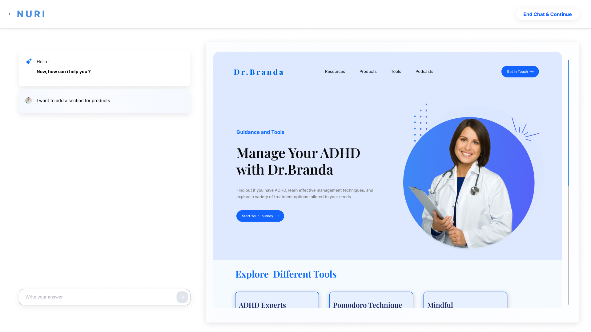

# 🩺 NURI - AI-Powered Website Personalization for Doctors

 <!-- Replace with your logo or a relevant image -->

**NURI** is an innovative platform that allows doctors to create and personalize their professional websites effortlessly. Powered by conversational AI, NURI enables doctors to add, edit, and organize sections like podcasts, tools, and product recommendations, providing a tailored experience for their patients.

---

## ✨ Key Features

### 💬 **Conversational AI Assistance**
- Interact with NURI’s AI assistant to:
  - Add new sections to your website.
  - Edit existing content.
  - Remove irrelevant elements.
- Get suggestions for podcasts, tools, and resources based on your patient demographics and needs.

### 🎯 **Personalized Website Sections**
1. **Podcasts**:
   - AI recommends podcasts on topics relevant to your specialty (e.g., ADHD management).
   - You can preview, edit, and add podcasts to your website.
2. **Product Recommendations**:
   - Suggests relevant products such as supplements, tools, or medications.
   - Customize how products are displayed (grid or carousel format).
3. **Guidance and Tools**:
   - Provides curated content, such as ADHD guides, mindfulness practices, or management techniques.

### 🛠️ **Flexible Design Options**
- Choose how sections are displayed on your website (e.g., grid or carousel layouts).
- AI ensures a professional, visually appealing presentation.

---

## 🚀 How It Works

### Step 1: Start a Conversation
- Access the NURI platform and initiate a chat with the AI assistant.
- Ask questions or request suggestions for your website content.

### Step 2: Add or Edit Website Sections
- The AI suggests sections based on patient needs and healthcare trends.
- Add content like podcasts, products, or tools directly from the chat.

### Step 3: Customize the Layout
- Choose how to display your content (e.g., grid or carousel format).
- Preview and adjust the layout for a personalized touch.

### Step 4: Publish the Website
- Save and publish your personalized website.
- Share it with patients to provide them with valuable resources and a professional online presence.

---

## 🌟 Why NURI is Essential for Doctors

- **Effortless Customization**:
  - No technical expertise required—AI handles everything for you.
- **Patient-Centered Approach**:
  - Provide engaging, relevant, and valuable resources to your patients.
- **Saves Time**:
  - Automates website creation and updates so you can focus on patient care.
- **Professional Branding**:
  - Helps maintain a modern and professional online presence.

---

## 📸 Screenshots

### Example Conversations with the AI Assistant
#### Doctors requesting AI to add sections:

#### AI recommending ADHD podcasts and other resources:

#### Personalizing the display format for content:

#### Finalized website layout for patient interaction:

---

## 🌐 Getting Started

### Prerequisites
Ensure you have:
- A NURI account.
- Basic information about the content you’d like to showcase on your website.

### Steps to Begin
1. **Sign Up**:
   - Register for an account on the NURI platform.
2. **Start Customizing**:
   - Chat with the AI assistant to add and personalize sections for your website.
3. **Publish Your Website**:
   - Save and publish your professional website to engage your patients.

---

## ✨ Future Roadmap

- Enhanced AI suggestions for a wider range of medical specialties.
- Integration with EHR systems for automated content updates.
- Advanced analytics to track patient engagement and website performance.

---

## :star: Give A Star

If you find NURI helpful, give this repository a ⭐ to support us and help others discover it!

---

This `README.md` is complete and formatted to include all the relevant information about the project, its features, and usage instructions. Let me know if you’d like to add or modify any sections! 🚀
